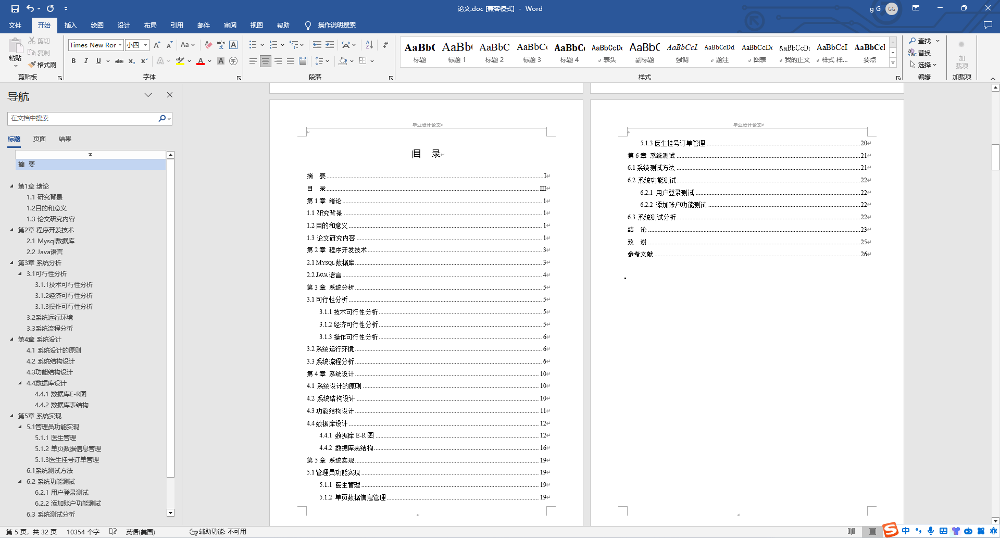
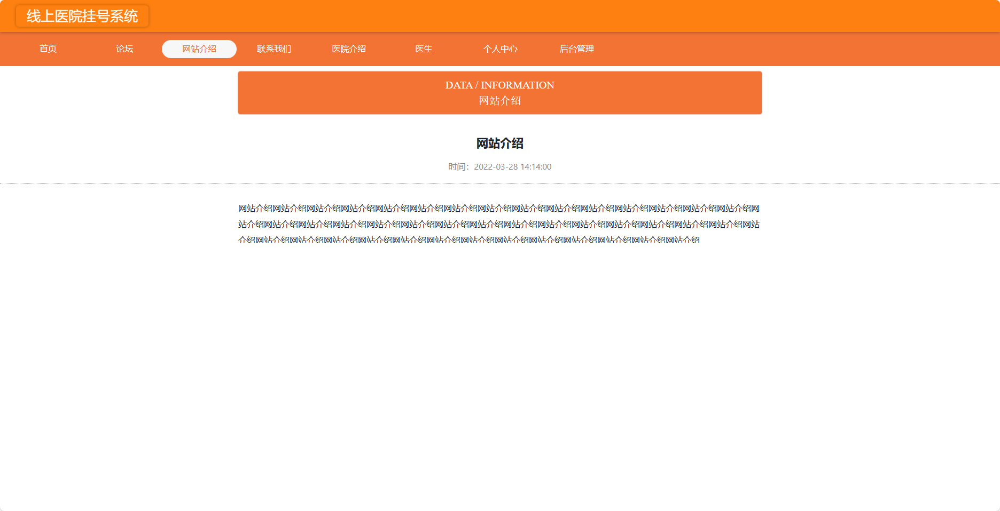
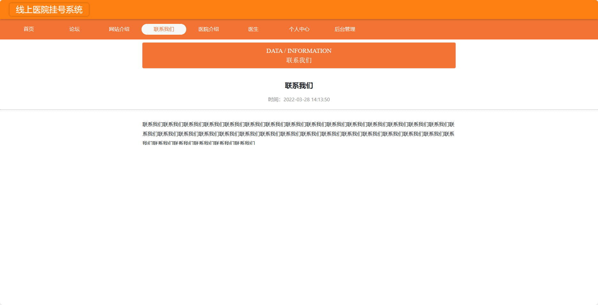
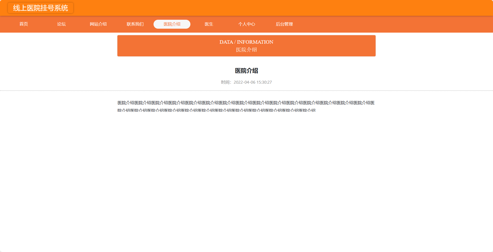
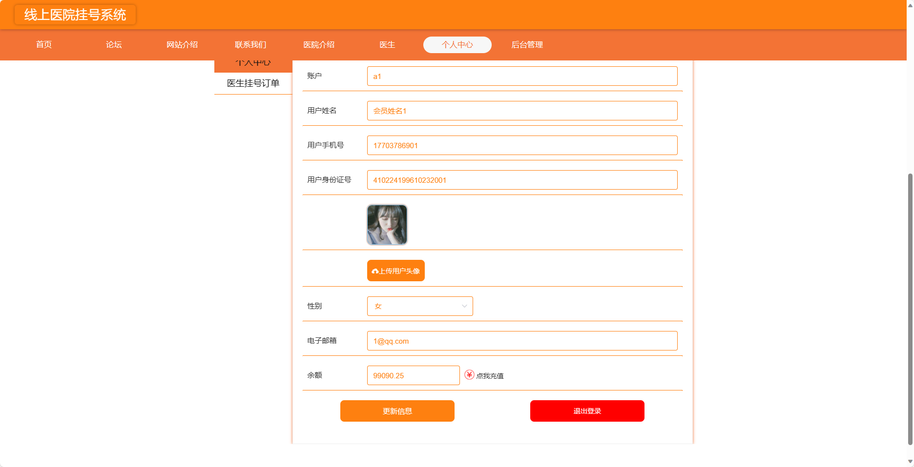
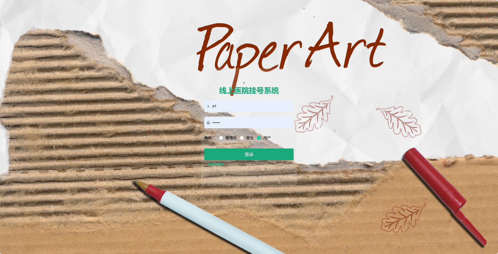
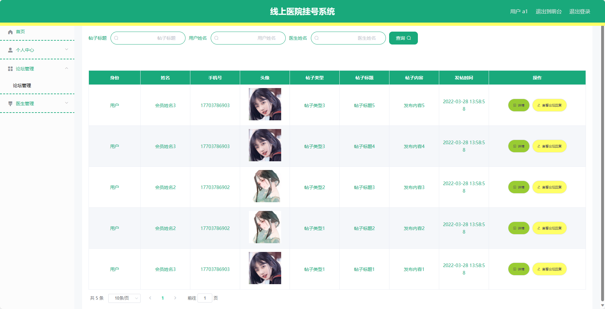

基于SpringBoot的线上医院挂号系统（程序+论文）
=
- 完整代码获取地址：从戎源码网 ([https://armycodes.com/](https://armycodes.com/))
- 作者微信：19941326836  QQ：952045282 
- 承接计算机毕业设计、Java毕业设计、Python毕业设计、深度学习、机器学习
- 选题+开题报告+任务书+程序定制+安装调试+论文+答辩ppt 一条龙服务
- 所有选题地址https://github.com/nature924/allProject

一、项目介绍
---
基于Spring Boot框架实现的线上医院挂号系统，系统包含三种角色：管理员、医生、用户,系统分为前台和后台两大模块，主要功能如下。
### 前台功能：

1. 首页：展示医院的相关信息，包括新闻公告、特色科室等内容。
2. 论坛：用户可以在论坛上进行讨论和交流。
3. 网站介绍：展示医院网站的介绍和相关信息。
4. 联系我们：提供联系方式和在线留言功能。
5. 医院介绍：详细介绍医院的历史、规模、荣誉等信息。
6. 医生：用户可以查看医生的排班信息和专业领域，以便选择合适的医生进行挂号。
7. 个人中心：用户可以管理个人信息、挂号记录、订单状态等。

### 后台功能：

### 用户：

1. 个人中心：管理个人信息。
2. 论坛管理：管理论坛帖子，包括查看、删除、置顶等操作。
3. 医生管理：管理医生信息，包括添加、编辑、删除医生信息。
  
### 管理员：

1. 个人中心：管理个人信息。
2. 基础数据管理：管理基础数据，包括科室信息、医院信息等。
3. 论坛管理：对论坛帖子进行管理，包括查看、删除、置顶等操作。
4. 用户管理：管理注册用户信息，包括查看、冻结、删除用户等操作。
5. 单页数据管理：管理网站单页信息，如网站介绍、联系方式等。
6. 医生管理：管理医生信息，包括添加、编辑、删除医生信息。
7. 轮播图信息：管理首页轮播图信息，包括添加、编辑、删除轮播图等操作。

### 医生：

1. 个人中心：管理个人信息。
2. 论坛管理：管理医生在论坛上的帖子，包括查看、删除、回复等操作。
3. 医生管理：管理医生个人资料，包括编辑个人介绍、排班信息等。
4. 医生留言管理：管理患者给医生的留言信息，包括查看、回复等操作。
5. 医生挂号订单管理：管理患者对医生的挂号订单，包括查看、处理、取消订单等操作。

二、项目技术
---
- 编程语言：Java
- 数据库：MySQL
- 项目管理工具：Maven
- 前端技术：VUE、HTML、Jquery、Bootstrap
- 后端技术：Spring、SpringMVC、MyBatis

三、运行环境
---
- 操作系统：Windows、macOS都可以
- JDK版本：JDK1.8以上都可以
- 开发工具：IDEA、Ecplise、Myecplise都可以
- 数据库: MySQL5.7以上都可以
- Tomcat：任意版本都可以
- Maven：任意版本都可以

四、运行截图
---
### 论文截图：

### 程序截图：

